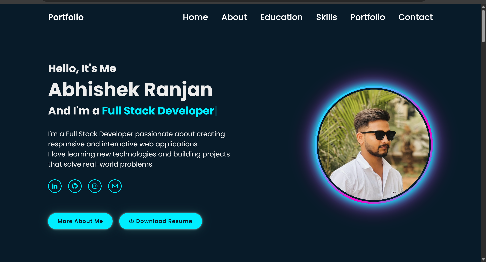
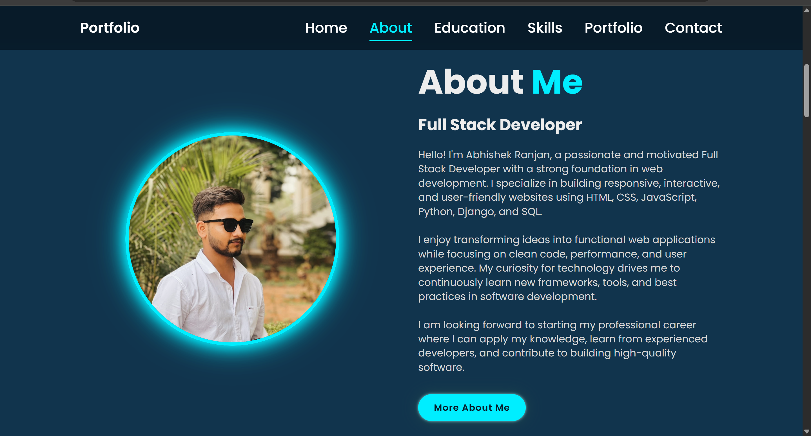
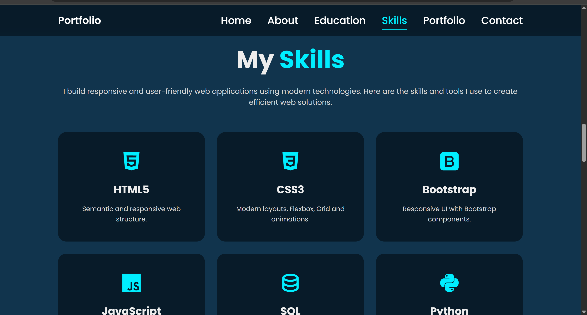
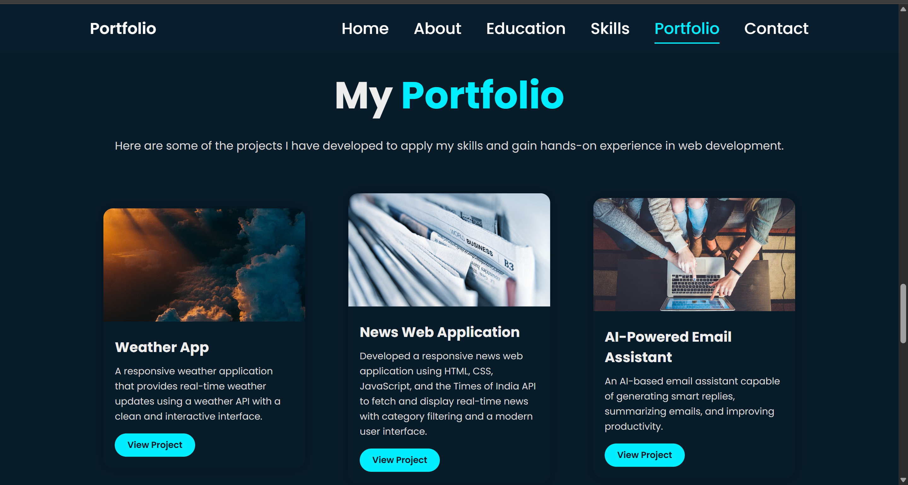
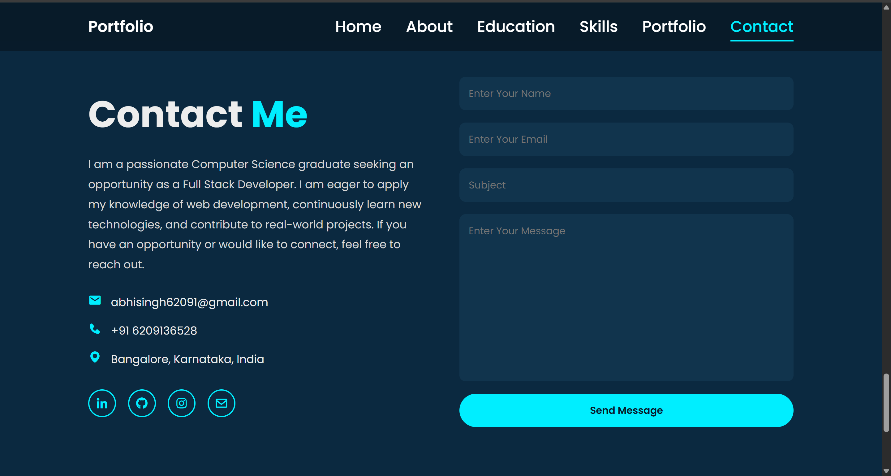

# 💼 Personal Portfolio

A modern and responsive personal portfolio website built using **HTML**, **CSS**, and **JavaScript** to showcase my skills, education, projects, and contact information.

## 🌐 Live Demo

## 🌐 Live Demo


🔗 https://abhi003cs.github.io/<my portfolio>/

## 📸 Preview

### Home


### About


### Skills


### Portfolio


### Contact


---

## ✨ Features

- Responsive Design
- Smooth Scrolling
- Active Navigation Bar
- Typing Animation
- Resume Download
- Project Showcase
- Contact Section
- Social Media Links

---

## 🛠️ Tech Stack

- HTML5
- CSS3
- JavaScript
- Typed.js
- Boxicons

---

## 📂 Folder Structure

```text
Portfolio/
│── index.html
│── style.css
│── script.js
│── README.md
└── screenshots/
```

---

## 🚀 Getting Started

```bash
git clone https://github.com/abhi003cs/portfolio.git
```

Open `index.html` in your browser.

---

## 📬 Contact

**Abhishek Ranjan**

📧 Email: abhisingh62091@gmail.com

🔗 LinkedIn: https://www.linkedin.com/in/abhishek-ranjan-a158bb35b/

💻 GitHub: https://github.com/abhi003cs

---

⭐ If you like this project, don't forget to give it a star!